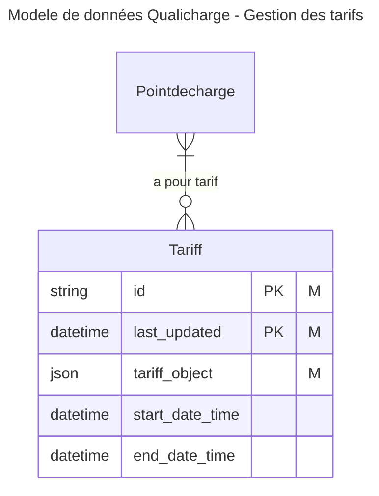
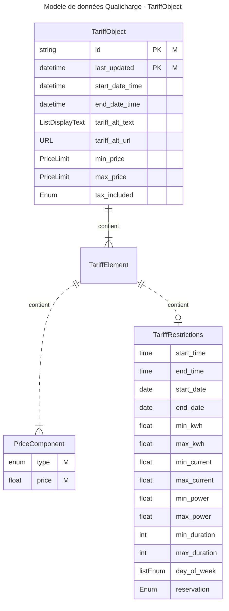

# modele de données Tariff

Le modèle de données interne est décrit dans le [document d'analyse](https://docs.numerique.gouv.fr/docs/0d46debd-340e-4321-adb2-f08473adddb1/).

## Modèle externe d'un tarif

Ce modèle représente les données associées à la gestion d'un tarif. Le tarif est dans ce cas considéré comme un objet décrit par un format Json.

L'attribut `tarif_object` est la représentation Json d'un `TariffObject` tel que fourni par un opérateur.

Les autres attributs associés au `Tariff` sont extraits de la représentation Json et sont utilisés pour :

- `tariff_id` et `last_updated` : déterminer l'unicité d'un tarif (éviter les doublons)
- `start_date_time` et `end_date_time` : déterminer le tarif applicable 

Parmi les tarifs associés à un pdc, le tarif applicable à un instant donné est celui dont la `start_date_time` est la plus proche de l'instant  (ou si aucune `start_date_time` n'existe, celui avec `last_updated` le plus récent) parmi ceux avec une `end_date_time` nulle ou postérieure à l'instant.

## Modèle interne d'un tarif

Structure de données utilisée dans le traitement des objet Tariff.

