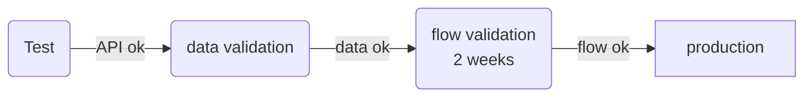

# FAQ qualicharge

## Pourquoi mon jeu de données passe dans transport.data.gouv mais pas dans Qualicharge ?

Les données des infrastructures de recharge des véhicules électriques font déjà l'objet d'une consolidation au niveau de *transport.data.gouv.fr*. Cette consolidation s'appuie sur un [schéma de données détaillé](https://doc.transport.data.gouv.fr/type-donnees/infrastructures-de-recharge-de-vehicules-electriques-irve) qui précise la nature et le format de chaque attribut attendu.

Les données Qualicharge respectent le schéma de données IRVE en le complétant (par exemple avec la notion de session) ou en le renforçant (des données facultatives peuvent devenir obligatoires).

Deux types de règles supplémentaires sont néanmoins intégrées :

- format des attributs : certains attributs sont rendus obligatoires : 
  - "nom_amenageur", "siren_amenageur", "contact_amenageur", "contact_operateur", "telephone_operateur", "num_pdl",
- relations entre attributs : Pour des points de recharge associés à une même station ("id_station_itinerance" identique), les attributs suivants doivent être identiques :
  - "nom_amenageur", "siren_amenageur", "contact_amenageur"
  - "nom_operateur", "contact_operateur", "telephone_operateur"
  - "nom_enseigne",
  - "nom_station", "implantation_station", "integer nbre_pdc", "condition_acces", "horaires", "station_deux_roues", "date_maj", "num_pdl", "id_station_local", "raccordement", "date_mise_en_service",
  - "coordonneesXY",
  - de même, pour deux points de recharge avec le même attribut "coordonneesXY", les attributs "adresse_station" et "code_insee_commune" doivent être identiques.

Si un de ces cas se présente dans l'utilisation des API de chargement de Qualicharge, le résultat de la requête sera :

- avec l'API bulk, l'API renvoie une erreur.
- avec l'API post/put simple, la valeur du champ écrase la valeur existante.

Certains contrôles spécifiques peuvent également être réalisés. Par exemple :

- les coordonnées "coordonnéesXY" doivent être incluses dans les polygones du territoire français,

## A quoi correspondent les notions de 'point de recharge' et de 'station' utilisées dans Qualicharge ?

La structure des données de Qualicharge s'appuie sur les notions définies par la réglementation AFIR (Alternative Fuels Infrastructure - [règlement UE 2023/1804 du 13/09/2023](https://eur-lex.europa.eu/eli/reg/2023/1804/oj)), en particulier les notions de point de recharge, station de recharge et parc de recharge :

  "*point de recharge: une interface fixe ou mobile, sur réseau ou hors réseau, qui permet de transférer de l’électricité vers un véhicule électrique et qui, bien qu’elle puisse être équipée d’un ou de plusieurs connecteurs pour prendre en charge différents types de connecteurs, n’est capable de recharger qu’un seul véhicule électrique à la fois, à l’exclusion des dispositifs d’une puissance de sortie inférieure ou égale à 3,7 kW dont la fonction principale n’est pas de recharger des véhicules électriques*"

  "*station de recharge: une installation physique en un lieu spécifique, composée d’un ou de plusieurs points de recharge*"

  "*parc de recharge: une ou plusieurs stations de recharge en un lieu spécifique*"

La notion de point de recharge est explicite dans sa formulation. Les notions de stations de recharge et de parcs de recharge nécessitent néanmoins une explication complémentaire :

- la station de recharge est définie dans la règlementation AFIR au travers des informations qui lui sont associées. On peut ainsi la définir comme étant un regroupement de points de recharge partageant les mêmes informations de gestion et de pilotage. Par exemple :
  - une localisation géographique,
  - un rattachement administratif (propriétaire, opérateur, aménageur),
  - des conditions tarifaires,
  - des propriétés (accessibilité, horaires)

  Ainsi, par exemple, deux points de recharge ne partageant pas la même localisation ne pourront être associés à la même station.
  
  Le périmètre d'une station reste a l'appréciation des opérateurs et aménageurs (il peut être restreint à quelques points de recharge ou au contraire regrouper plusieurs dizaine de points de recharge).

- le parc de recharge ne fait référence à aucune activité de gestion mais est associé exclusivement aux exigences règlementaire portant sur un lieu. Ainsi un parc regroupe par exemple toutes les stations d'une aire de service autoroutière ou bien d'une gare ou d'un aéroport. Il reflète en ce sens le besoin usager de recharge en un lieu donné.

Dans le cadre de Qualicharge la notion de station est conforme à la notion présentée dans la règlementation AFIR. La notion de parc de recharge n'est pas utilisée.

## Quelles sont les autres notions utilisées dans Qualicharge ?

Outre les stations et points de recharge, le modèle Qualicharge s'appuie sur les entités suivante :

- **aménageur** : entité publique ou privée propriétaire des infrastructures (définition du schéma de données),
- **opérateur** : personne qui exploite l'infrastructure de recharge pour le compte d'un aménageur dans le cadre d'un contrat ou pour son propre compte s'il est l'aménageur (définition du schéma de données)
- **enseigne** : nom commercial du réseau (définition du schéma de données)
- **localisation** : localisation géographique et administative d'une station
- **operational unit** (unité d'exploitation): réseau d’infrastructures de recharge exploité par un unique opérateur d’infrastructure de recharge et accessible à l’itinérance par une seule connexion informatique (définition AFIREV)
- **status** : état instantané d'un point de recharge (occupation, fonctionnement)
- **session** : session de recharge d'un véhicule (durée, énergie)

## Est-ce que le numéro de PDL est bien un champs libre ?

Effectivement, le format des numéros de PDL à 14 digits n'est pas encore généralisé à tous les ELD (en cours). Il n'est donc pas imposé au niveau de l'API de Qualicharge.

Le contrôle des numéros de PDL s'effectue pendant le processus de validation sur la plateforme de 'staging' pour lequel nous vérifions que 90% des numéros de PDL sont bien avec 14 digits.

## Quelles sont les contraintes à respecter pour les données dynamiques ?

Les données dynamiques (sessions et statuts) doivent respecter les exigences suivantes :

- fraicheur : Le temps réel pour les status implique un délai maximal de 5 mn entre l'émission d'un status et son enregitrement dans Qualicharge. Pour les sessions, un délai de vérification est prévu. Le délai maximal de réception des sessions est de 15 jours entre la date de début de la session et son enregistrement dans Qualicharge.
- unicité : Les sessions et les status qui respecte le format défini sont enregistrés sans contrôle supplémentaire, il est donc demandé de ne pas effectuer d'envois multiples dans Qualicharge (contrôle de duplication).
- cohérence : les status et les sessions ne sont pas indépendants. En particulier, une session démarre lorsqu'un statut est émis avec un état d'occupation "occupe" et se termine lorsqu'un statut est émis avec un état d'occupation "libre".

Certaines contraintes spécifiques sont également à prendre en compte. On peut citer par exemple :

- l'énergie d'une session ne peut dépasser la puissance nominale du point de recharge multipliée par la durée de la session,
- le nombre de sessions d'un point de recharge est limité à 50 par jour.

### Quel est le processus de mise en production des données ?

La mise en production d'un flux de données dans Qualicharge s'effectue à l'issue d'un processus de validation.

Les étapes sont les suivantes :

**étape de test**

Des accès sont ouverts sur un environnement de "staging" identique à l'environnement de production. 

La plateforme est utilisée pour tester les API avec des jeux de données statiques ou dynamiques.

Les données enregistrées sur la base ne sont pas controlées et peuvent être supprimées à tout moment.

**étape de validation des données**

Cette deuxième étape a pour objectif de simuler un flux de production et de contrôler les données enregistrées.

Pendant cette phase, des rapports de contrôle sont envoyés régulièrement ou bien à la demande indiquant les problèmes résiduels à traiter.

Les données peuvent également être supprimées à la demande.

Cette étape peut comporter une première boucle de validation avec les données statiques uniquement puis une seconde avec les données dynamiques.

**étape de validation du flux**

Lorsque tous les contrôles sont valides, un test final d'une durée de deux semaines est réalisé avec des données de production.

A l'issue de cette période de deux semaines, un PV de recette est établi et le flux est basculé sur la plateforme de production.

La liste des contrôles et les critères d'acceptation associés sont joints au PV de recette (cf lien xxxx)