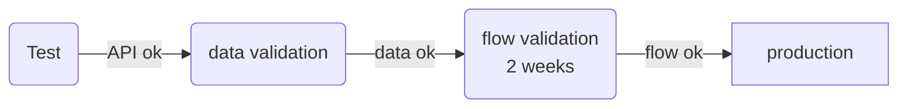

# Processus d'intégration d'un flux de données

## Contrôle des données

La connexion d'un flux de données dans Qualicharge implique de respecter plusieurs types de contraintes :

- format des attributs (voir schéma de données)
- relations entre attributs (lié au modèle de données)
- contraintes dynamiques (fraicheur, unicité, cohérence)
- contraintes spécifiques

Pour cela deux types de traitements sont en place dans Qualicharge :

- un contrôle a priori au niveau des API : Le chargement des données est conditionné par le respect des contraintes liées principalement au format des attributs et aux relations entre attributs
- un contrôle a posteriori sur un historique de données : Celui-ci concerne principalement les contraintes dynamiques et spécifiques.

## Processus

Les étapes pour atteindre la mise en production d'un flux de données sont les suivantes :

### étape de test

Des accès sont ouverts sur un environnement de "staging" identique à l'environnement de production.

La plateforme est utilisée pour tester les API avec des jeux de données statiques ou dynamiques.

Les données enregistrées sur la base ne sont pas controlées et peuvent être supprimées à tout moment.

### étape de validation des données

Cette deuxième étape a pour objectif de simuler un flux de production et de contrôler les données enregistrées.

Pendant cette phase, des rapports de contrôle sont envoyés régulièrement ou bien à la demande indiquant les problèmes résiduels à traiter.

Les données peuvent également être supprimées à la demande.

Cette étape peut comporter une première boucle de validation avec les données statiques uniquement puis une seconde avec les données dynamiques.

### étape de validation du flux

Lorsque tous les contrôles sont valides, un test final d'une durée de deux semaines est réalisé avec des données de production.

A l'issue de cette période de deux semaines, un PV de recette est établi et le flux est basculé sur la plateforme de production.

La liste des contrôles et les critères d'acceptation associés sont joints au PV de recette (cf lien xxxx)
