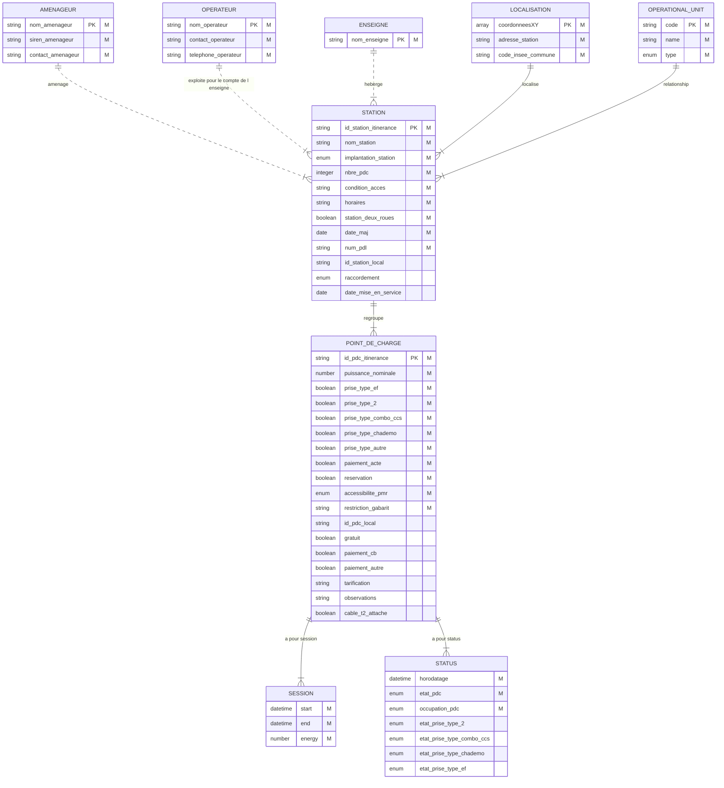

suivi de la consommation de chaque opérateur

# Processus d'intégration d'un flux de données

## Contexte

L'intégration des données dans Qualicharge s'appuie sur un processus rigoureux pour garantir un haut niveau de qualité des données.

Les objectifs recherchés par cette intégration sont :

- d'obtenir une image fidèle et actualisée des infrastructures de recharge déployées,
- de suivre précisément la consommation de chaque opérateur (calcul des certificats TIRUERT alloués)
- de mettre à disposition en temps réel les données d'usage sur le point d’accès national *transport.data.gouv.fr*

Le processus mis en place s'appuie sur une définition précise des données attendues (structure de données) ainsi que sur un ensemble de contrôles des flux de données mis en place par chaque opérateur.

## Structure des données

### Principales notions

La structure des données de Qualicharge s'appuie sur les notions définies par la réglementation AFIR (Alternative Fuels Infrastructure - [règlement UE 2023/1804 du 13/09/2023](https://eur-lex.europa.eu/eli/reg/2023/1804/oj)), en particulier les notions de point de recharge, station de recharge et parc de recharge :

  "*point de recharge: une interface fixe ou mobile, sur réseau ou hors réseau, qui permet de transférer de l’électricité vers un véhicule électrique et qui, bien qu’elle puisse être équipée d’un ou de plusieurs connecteurs pour prendre en charge différents types de connecteurs, n’est capable de recharger qu’un seul véhicule électrique à la fois, à l’exclusion des dispositifs d’une puissance de sortie inférieure ou égale à 3,7 kW dont la fonction principale n’est pas de recharger des véhicules électriques*"

  "*station de recharge: une installation physique en un lieu spécifique, composée d’un ou de plusieurs points de recharge*"

  "*parc de recharge: une ou plusieurs stations de recharge en un lieu spécifique*"

La notion de point de recharge est explicite dans sa formulation. Les notions de stations de recharge et de parcs de recharge nécessitent néanmoins une explication complémentaire :

- la station de recharge est définie dans la règlementation AFIR au travers des informations qui lui sont associées. On peut ainsi la définir comme étant un regroupement de points de recharge partageant les mêmes informations de gestion et de pilotage. Par exemple :
  - une localisation géographique,
  - un rattachement administratif (propriétaire, opérateur, aménageur),
  - des conditions tarifaires,
  - des propriétés (accessibilité, horaires)

  Ainsi, par exemple, deux points de recharge ne partageant pas la même localisation ne pourront être associés à la même station.

- le parc de recharge ne fait référence à aucune activité de gestion mais est associé exclusivement aux exigences règlementaire portant sur un lieu. Ainsi un parc regroupe par exemple toutes les stations d'une aire de service autoroutière ou bien d'une gare ou d'un aéroport. Il reflète en ce sens le besoin usager de recharge en un lieu donné.

Dans le cadre de Qualicharge la notion de station est conforme à la notion présentée dans la règlementation AFIR. La notion de parc de recharge n'est pas utilisée.

### Schéma de données IRVE

Les données des infrastructures de recharge des véhicules électriques font déjà l'objet d'une consolidation au niveau de *transport.data.gouv.fr*. Cette consolidation s'appuie sur un [schéma de données détaillé](https://doc.transport.data.gouv.fr/type-donnees/infrastructures-de-recharge-de-vehicules-electriques-irve) qui précise la nature et le format de chaque attribut attendu.

Les données Qualicharge respectent le schéma de données IRVE en le complétant (par exemple avec la notion de session) ou en le renforçant (des données facultatives peuvent devenir obligatoires).

### Modèle de données Qualicharge

Outre les stations et points de recharge, le modèle Qualicharge s'appuie sur les entités suivante :

- **aménageur** : entité publique ou privée propriétaire des infrastructures (définition du schéma de données),
- **opérateur** : personne qui exploite l'infrastructure de recharge pour le compte d'un aménageur dans le cadre d'un contrat ou pour son propre compte s'il est l'aménageur (définition du schéma de données)
- **enseigne** : nom commercial du réseau (définition du schéma de données)
- **localisation** : localisation géographique et administative d'une station
- **operational unit** (unité d'exploitation): réseau d’infrastructures de recharge exploité par un unique opérateur d’infrastructure de recharge et accessible à l’itinérance par une seule connexion informatique (définition AFIREV)
- **status** : état instantané d'un point de recharge (occupation, fonctionnement)
- **session** : session de recharge d'un véhicule (durée, énergie)

Il est présenté ci-dessous sous la forme "entité-association". Les attributs liés à ce modèle sont explicités dans le schéma de données (à l'exception des attributs liés aux sessions)

*figure 1 :* *Modele qualicharge - v0.5.0*

Notation :

- PK: Indique un attribut identifiant de façon unique une entité (ex. "coordonneesXY" identifie de façon unique une localisation)
- M : Indique un attribut devant être renseigné obligatoirement
- relation entre entités : Les relations indiquées sont des relations 1-n exprimant le fait que dans un sens, une entité A peut être associée à plusieurs entités B mais que dans l'autre sens une entité B peut etre associée à une seule entité A (ex. une station est associée à une seule location mais une location peut être associée à plusieurs stations).

### Contraintes sur les données

La présence d'un modèle de données et d'un schéma de données induit plusieurs type de règles à respecter:

- format des attributs : le format à respecter pour les attributs est défini dans le schéma de données,
- relations entre attributs : chaque attribut est associé à une entité par une relation 1-n. Lorsque l'entité est définie par un attribut principal cela signifie qu'on ne peut avoir deux valeurs d'attribut différentes associés à un même attribut principal. Par exemple :
  - une même "coordonneesXY" ne peut être associée à deux "adresse_station" différentes,
  - on ne peut avoir deux "num_pdl" différents pour un même "id_station_itinerance"
- relations entre entités : les relations 1-n entre entités induisent également des règles similaires aux attributs. Par exemple :
  - deux points de recharge d'une même station ne peuvent avoir des "coordonneesXY" différentes (relation entre station et location)
  - deux points de recharge d'une même station ne peuvent avoir des "nom_operateur" différents (relation entre station et operateur)

Si les relations liées à une station sont trop contraignantes, il est possible de décomposer une station en deux stations. Par exemple, pour les stations multi-PDL, on peut séparer la station en deux stations associées chacune à un PDL unique.

### Contraintes sur les données dynamiques

Les données dynamiques doivent respecter les exigences suivantes :

- fraicheur : Le temps réel pour les status implique un délai maximal de 5 mn entre l'émission d'un status et son enregitrement dans Qualicharge. Pour les sessions, la contrainte est moins forte, un délai d'une journée est demandé,
- duplication : Les sessions et les status qui respecte le format défini sont enregistrés sans contrôle supplémentaire, il est donc demandé de ne pas dupliquer leur envoi dans Qualicharge.
- cohérence : les status et les sessions ne sont pas indépendants. En particulier, une session démarre lorsqu'un status est émis avec un état d'occupation "occupe" et se termine lorsqu'un status est émis avec un état d'occupation "libre".

### Contraintes spécifiques

Certaines contraintes qui ne s'expriment pas au travers d'un modèle ou d'un schéma de données sont également à prendre en compte. On peut citer par exemple :

- l'énergie d'une session ne peut dépasser la puissance nominale multipliée par la durée de la session,
- les coordonnées doivent être incluses dans les polygones du territoire français,
- le nombre de sessions d'un point de recharge est limité à 50 par jour

## Flux de données

La connexion d'un flux de données dans Qualicharge implique :

- la prise en compte du schéma de données,
- le respect du modèle de données,
- la cohétrence des données dynamiques.

 soit
est mis en 
Le processus de mise en place d'un flux de données dans Qualicharge intègre plusieurs étapes 