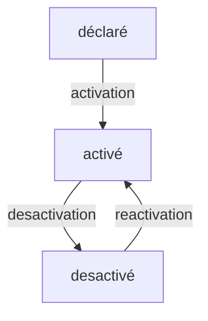
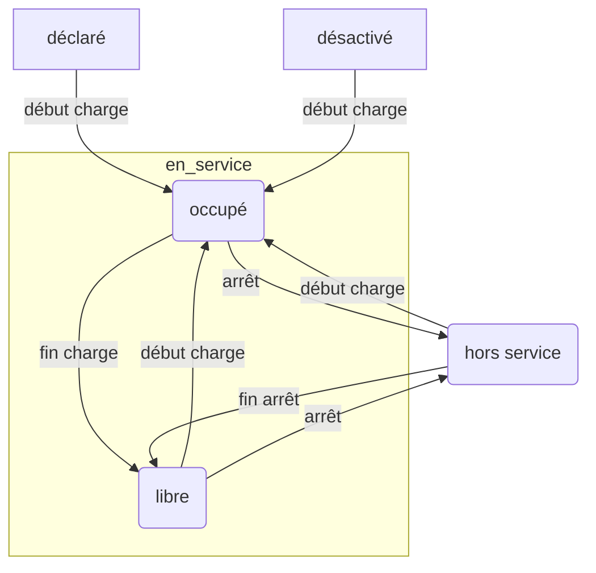

# Indicateurs d'usage - Qualicharge

## Besoin

Les principaux indicateurs demandés concernent :

- la disponibilité de la recharge (ratio de la durée en service sur le temps d'ouverture),
- le taux d'utilisation des installations (ratio de la durée de recharge sur la durée en service),
- les saturations lors de périodes spécifiques (aucun point de recharge disponible)
- le facteur de charge (ratio du consommé sur le maximum consommable)
- le taux de sessions réussies (durée et charge supérieures à des seuils)

Les indicateurs associés aux sessions (charge partielle/complète, session réussie) ne sont pas abordés.

Pour caractériser ces indicateurs, plusieurs définitions ont été établies notamment par l'AFIREV (voir en Annexe)

## Principes généraux

### Etats globaux des points de recharge

Un point de recharge a trois états successifs :

- "déclaré" : Point de recharge créé mais non encore utilisé
- "en activité" : Point de recharge utilisé
- "desactivé" : Point de charge plus utilisé

Cette distinction permet les calculs de taux d'utilisation et de taux de disponibilité qui ne s'appliquent qu'aux points de recharge "en activité".

Le passage d'un état à un autre s'effectue par une transition.

*Nota :*

- En l'absence de transition explicite d'activation et de réactivation, on considère que l'activation et la réactivation s'effectuent par le démarrage d'une recharge
- En l'absence de transition explicite de désactivation, on considère que la désactivation a lieu après une période longue sans "session" ni "status" (ex. 1 mois)

### Etats d'utilisation des points de recharge

Le calcul des indicateurs repose sur l'enregistrement du temps passé dans chacun des trois états principaux d'un point de recharge "en activité" :

- "libre" : En fonctionnement, non occupé et pendant la période d'ouverture
- "occupe" : En charge
- "hors service" : Mise à l'arrêt (ex. maintenance) ou arrêt intempestif (défaillance : statut erreur ou inconnu).

*NOTA :*

- Chacun des trois états (libre, occupé, hors service) peut être doublé pour tenir compte des périodes d'ouverture du point de recharge.
  - requis: pendant la période d'ouverture,
  - non requis: hors période d'ouverture.
- L'état "hors_service" peut être décomposé en états plus précis en fonction du temps de présence :
  - interruption courte < 2h,
  - interruption longue < 24h,
  - arrêt court < 7j,
  - arrêt long > 7j.

**Dans un premier temps, on se limite au suivi du temps passé dans les trois états principaux "libre", "occupe", "hors_service" et avec un temps d'ouverture de 100 %.**

### Suivi des états des stations

L'état des stations est à considérer pour prendre en compte la notion de saturation.

On peut alors distinguer les états suivants calculés à partir des états des points de recharge associés :

- "déclaré" : tous les pdc sont dans l'état "declare",
- "désactivé" : tous les pdc sont dans l'état "desactive",
- "hors_service" : aucun pdc n'est dans l'état "libre" ou "occupe" et au moins un pdc est dans l'état "hors_service",
- "saturé" : aucun pdc n'est dans l'état "libre" et au moins un pdc est dans l'état "occupe",
- "active" : au moins un pdc est dans l'état "libre" et au moins un pdc est dans l'état "occupe"
- "inactive" : au moins un pdc est dans l'état "libre" et aucun pdc n'est dans l'état "occupe"

L'application de ces états conduit à interdire un état dans lequel une partie des pdc est dans l'état "declare" et l'autre dans l'état "desactive".

L'application de ces règles pour une station composée d'un seul point de recharge est la suivante :

- "déclaré" : le pdc est dans l'état "declare",
- "désactivé" : le pdc est dans l'état "desactive",
- "hors_service" : le pdc est dans l'état "hors_service",
- "saturé" : le pdc est dans l'état "occupe",
- "active" : jamais
- "inactive" : le pdc est dans l'état "libre"

On a donc une correspondance entre l'état "occupe" du point de recharge et l'état "saturé" de la station ainsi qu'entre l'état "libre" du point de recharge et l'état "inactive" de la station.

Le calcul du temps passé dans chaque état peut être complexe et long. Un travail complémentaire est donc à mener pour aboutir sur une solution simple.

### Structure de données Qualicharge

La table `session` enregistre les périodes de charge effective (plus de 2 minutes ET avec une énergie supérieure à 0,5 kWh) :

- id (UUID),
- start (datetime),
- end (datetime),
- energy (number),

La table `status` enregistre les transitions entre deux modes de fonctionnement d'un point de recharge (ou bien un instantané d'un état du point de recharge). Les champs obligatoires sont :

- id (UUID),
- horodatage (datetime),
- etat_pdc (enum :"en_service", "hors_service", "inconnu"),
- etat_prise_xxx (enum : ""fonctionnel", "hors_service", "inconnu")
- occupation_pdc (enum : "libre", "occupe", "reserve", "inconnu")

Pour gérer implicitement (en l'absence de transition explicite) les états "declare" et "desactive", on peut utiliser les règles suivantes :

- un point de recharge est dans l'état "déclaré" s'il n'y a eu aucune donnée dynamique
- une occupation_pdc "occupe" ou un début de session provoque l'activation et la réactivation
- une absence de status/session pendant une période longue (ex. 1 mois) provoque le passage dans l'état "désactivé"

Si la période de rétention des status et session est représentative d'une période longue, on peut alors considérer qu'un pdc sans status ni session est dans l'état "déclaré" ou "désactivé".
Dans le cas contraire, il est nécessaire de conserver la date du dernier état. Sans cette date, il sera impossible de distinguer un état "desactive" d'un état "libre", ce qui rendra le calcul des taux de disponibilité et d'utilisation sur un périètre donné impossible.

Les trois états définis pour les point de recharge peuvent donc être suivi sur la base des transitions correspondants aux `status`:

- "libre" (après une transition déclenchée par les `status`: `etat_pdc` égal à "en_service" et `occupation_pdc` égal à "libre")
- "occupe" (après une transition déclenchée par les `status`: `etat_pdc` égal à "en_service" et `occupation_pdc` égal à "occupe")
- "hors_service" (après une transition liée à tous les autres `status`)

NOTA : Pour des raisons de simplicité, on autorise toutes les transitions (par exemple on n'impose pas pour passer de "hors_service" à "occupe" de passer d'abord de "hors-service" à "libre" puis de "libre" à "occupe"). Le `status` porte alors directement l'état d'arrivée de la transition.

## Indicateurs retenus pour Qualicharge

Les propositions ci-dessous s'appuient sur les définitions AFIREV, le retour d'expérience 2023 et la structure Qualicharge.

### Taux de disponibilité d'un point de recharge

Définition pour un point de recharge "en activité" :

- Temps de disponibilité (TD: temps passé dans les états "libre" et "occupe") divisé par le temps d'ouverture (TO) d'un point de recharge sur la période.
  
  Le temps de disponibilité TD peut également être calculé comme la différence du temps d'ouverture TO et du temps d'indisponibilité TI (TI: temps passé dans l'état "hors service")
  
  L'agrégation de plusieurs disponibilités est le rapport de la somme des TD sur la somme des TO. Ceci permet de traiter l'agrégation sur plusieurs échelles de temps ou sur un périmètre donné (uniquement les points de recharge dans l'état "en activité").

Exemples:

- si un pdc A est disponible à 100 % et un pdc B est disponible à 50 % sur la même période, l'ensemble aura une disponibilité de 75 %
- si un pdc A est disponible à 100 % sur un jour et à 25 % sur quatre jours, il aura une disponibilité de 40 % sur cinq jours.

### Taux d'utilisation d'un point de recharge

Définition pour un point de recharge "en activité" :

- Temps d'utilisation (TU : temps passé dans l'état "occupe") divisé par le temps de disponibilité (TD).

  Le temps d'utilisation TU peut également être calculé à partir des sessions (temps cumulé des sessions)
  
  L'agrégation s'effectue également en divisant la somme des numérateurs par la somme des dénominateurs (pour les points de recharge "en activité").

### Saturation

Définition :

- On peut considérer qu'une station a été saturée sur une période si elle a été saturée avec un temps supérieur à un seuil (à définir) sur cette période.
- On peut également calculer un taux de saturation comme étant le temps passé dans l'état "saturé" divisé par le temps passé dans les états "saturé", "active" et "inactive".

### Facteur de charge

Définition pour un point de recharge "en activité" :

- Cumul de `energy` divisé par l'énergie maximale (puissance multipliée par le temps d'ouverture) sur la période

L'agrégation s'effectue également en divisant la somme des numérateurs par la somme des dénominateurs (pour les points de recharge "en activité").

### Taux de sessions réussies

Une session réussie est une session ayant duré plus de 2 minutes et ayant fourni une énergie supérieure à 0,5 kWh.

Définition pour un point de recharge "activé"  :

- Nombre de `session` réussies divisé par le nombre total de `session` sur la période

L'agrégation s'effectue également en divisant la somme des numérateurs par la somme des dénominateurs (pour les points de recharge "en activité").

## Production des indicateurs

### Principes

Deux étapes sont à considérer :

- calcul du temps passé dans chaque état,
- calcul des indicateurs
  
Le calcul du temps passé dans chaque état nécessite d'avoir une vue séquentielle des `status` associés à un pdc. Ceci ne peut se faire au fil de l'eau que si la remontée des évènements dans Qualicharge est elle-même séquentielle.
Cette contrainte ne peut actuellement être assurée, le calcul doit donc s'effectuer de façon asynchrone.  

Par ailleurs, le temps passé dans chaque état pour un point de recharge ou pour une station est une information nécessaire pour les indicateurs mais qui peut être intéressante à suivre explicitement (notamment via les buckets de TimeScaleDB).

### Indicateurs

Les indicateurs d'usage proposés sont les suivants (pour une période donnée et sur un périmètre géographique) :

| id          | nom                                                            | Pr  | type  | historisé             |
| ----------- | -------------------------------------------------------------- | --- | ----- | --------------------- |
| q1-x-yy-z   | Durée de dysfonctionnement des pdc (état hors-service)         | 2   | usage | oui (national/région) |
| q2-x-yy-z   | Durée d'utilisation des pdc (état occupé)                      | 2   | usage | oui (national/région) |
| q3-x-yy-z   | Durée de non utilisation des pdc (état libre)                  | 2   | usage | oui (national/région) |
| q4-x-yy-z   | Durée d'ouverture                                              | 2   | usage | oui (national/région) |
| q5-x-yy-z   | Nombre de sessions                                             | 3   | usage | oui (national/région) |
| q6-x-yy-z   | Durée des sessions                                             | 3   | usage | oui (national/région) |
| q7-x-yy-z   | Durée d'activité des stations (état saturé, active ou inactive)| 2   | usage | oui (national/région) |
| q8-x-yy-z   | Durée de saturation des stations                               | 2   | usage | oui (national/région) |
| q9-x-yy-z   | Energie consommée                                              | 2   | usage | oui (national/région) |
| q10-x-yy-z  | Nombre de sessions réussies                                    | 2   | usage | oui (national/région) |
| q11-x-yy-z  | Puissance des points de recharge activés                       | 2   | usage | oui (national/région) |
| q12-x-yy-z  | Taux de disponibilité par catégorie de puissance               | 3   | usage | synthèse              |
| q13-x-yy-z  | Taux d'utilisation                                             | 2   | usage | synthèse              |
| q14-x-yy-z  | Taux de saturation des stations                                | 2   | usage | synthèse              |
| q15-x-yy-z  | Facteur de charge                                              | 2   | usage | synthèse              |
| q16-x-yy-z  | Taux de sessions réussies                                      | 2   | usage | synthèse              |

q1, q2, q3, q4, q5, q6, q7, q8, q9, q10, q11 sont les valeurs cumulées (ex. moyenne, somme)

q1 et q4 sont calculés par catégorie de puissance

q4 est la durée de 24h multipliée par le nombre de points de recharge dans l'état "en activité"

q5 est le nombre de sessions démarrées dans la période concernée

q6 est la part de la durée dans la période des sessions démarrées ou terminées dans la période

q9 est la part de l'énergie (au prorata de la durée passée) dans la période des sessions

q12 est calculé à partir de q1 et de q4

q13 est calculé à partir de q2 et de q3 (ou de q1, q4 et q6)

q14 est calculé à partir de q8 et de q7

q15 est calculé à partir de q9 et de q11

q16 est calculé à partir de q10 et de q5

### Calcul des informations d'état

Pour les points de recharge, chaque `status` est considéré comme une transition qui indique le nouvel état.

Le temps passé entre deux `status` successifs correspond donc à une durée dans l'état défini par le premier `status` (l'état initial d'une période est l'état final de la période précédente).
Les durées sont alors cumulées pour tous les `status` d'une période.

Pour permettre d'aggréger les durées, il est nécessaire d'avoir des durées discrétisées (sur des intervalles de temps à dates fixes). Ceci permet notamment l'aggrégation au niveau des stations (pour le calcul de saturation).

L'énergie consommée sur une période se déduit des `session`. Lorsqu'une session est à cheval sur plusieurs périodes, on peut répartir l'énergie à chaque période au prorata de la durée de la session dans chaque période. L'autre option est d'associer l'ensemble de l'énergie à la date de début de session (méthode plus simple retenue dans un premier temps).

Pour identifier les points de recharge "en activité", deux options sont possibles :

- calcul dynamique : dans ce cas, un point de recharge est en activité s'il y a au moins un status ou une session dans la période retenue (ex. 1 mois)
- calcul statique : pour cette option, on stocke l'information "last_activity" sur la table des points de recharge (calculée à chaque historisation)

### Historisation

L'historisation initiale intègre le calcul des durées (via une discrétisation pour la saturation) et le découpage en périodes horaires.

Trois attributs sont associés à l'historisation :

- VALUE(float) : valeur principale (instantanée ou moyenne)
- EXTRAS(json) - optionnel : valeur additionnelle
- CATEGORY(string ou enum) - optionnel : décomposition associée à l’indicateur

Proposition :

- VALUE : valeur de l'indicateur (durée, nombre, énergie ou puissance),
- EXTRAS : non utilisé pour l'historisation initiale
- CATEGORY : niveau de puissance (pour les indicateurs ventilés par niveau de puissance)

### Calcul des indicateurs

Le calcul des indicateurs ne présente pas de spécificités (idem autre indicateurs).

## Annexe : Définitions

[Disponibilité (NF EN 13306)](http://maint.t.i.b.free.fr/Files/Other/NF%20EN%2013306.pdf)

Aptitude d’un bien à être en état d’accomplir une fonction requise dans des conditions données, à un instant donné ou pendant un intervalle de temps donné, en supposant que la fourniture des moyens extérieurs est assurée.

[Taux de sessions de recharge réussies (définition AFIREV)](https://www.observatoire-recharge-afirev.fr/wp-content/uploads/2023/06/ObsAFIREV2023_AnnexesMethodologiques-1.pdf)

Le taux de sessions de recharge réussies est le rapport entre le nombre des sessions de recharge réussies et le nombre total de sessions de recharge sur la période considérée. Sont considérées comme « réussies », les sessions de recharge respectant un des deux critères suivants :

- Les sessions de recharge ayant duré plus de 2 minutes ET ayant fourni une énergie supérieure à 0,5 kWh.
- Les sessions de recharge ayant été interrompues volontairement par le client.

Seules les sessions de recharge démarrées après authentification puis autorisation du superviseur sont prises en compte dans le calcul (présentant un « start » ou autre statut équivalent permettant d’identifier le lancement de la recharge depuis l’outil de supervision des bornes). Les sessions de recharge sur des prises de type EF sont intégrées au calcul.

[Taux de disponibilité des points de recharge (définition AFIREV)](https://www.observatoire-recharge-afirev.fr/wp-content/uploads/2023/06/ObsAFIREV2023_AnnexesMethodologiques-1.pdf)

Le taux de disponibilité des points de recharge est le rapport entre le temps de disponibilité des points de recharge et le temps total de la période étudiée. Sont considérées comme « indisponible » un point de recharge dont l’état est :

- En statut erreur (« Faulted » ou « OutOfOrder »)
- En statut inconnu, c’est-à-dire en perte de communication (« Unknown ») depuis plus de 24h.
- Dont l’accès est impossible à l’usager peu importe la cause (ex : maintenance)

Seule la disponibilité lors des horaires d’ouverture commerciaux de la station (horaires communiqués à l’usager) est prise en compte. Dans ce cas, au dénominateur de l’indicateur, le temps total de la période étudiée est le temps total d’ouverture de la station sur la période étudiée.  Le calcul du temps de disponibilité d’un point de recharge s’effectue comme une moyenne du temps de disponibilité des connecteurs de ce point de recharge.

[Taux de points de charge disponibles 99% du temps (définition AFIREV)](https://www.observatoire-recharge-afirev.fr/wp-content/uploads/2023/06/ObsAFIREV2023_AnnexesMethodologiques-1.pdf)

Le taux de points de charge disponibles 99% du temps est le nombre de points de charge réputés disponibles plus de 99% du temps par rapport au nombre total de points de charge en interopérabilité dans la plateforme Gireve. La définition d’un point de charge indisponible est celle de la charte qualité de l’AFIREV:

- est considéré indisponible un point de charge en statut Hors Service.

[Taux de points de charge indisponibles depuis plus de 7 jours (définition AFIREV)](https://www.observatoire-recharge-afirev.fr/wp-content/uploads/2023/06/ObsAFIREV2023_AnnexesMethodologiques-1.pdf)

Le taux de points de charge indisponibles depuis plus de 7 jours est le nombre de points de charge indisponibles depuis plus de 7 jours par rapport au nombre total de points de charge en interopérabilité dans la plateforme Gireve. La définition d’un point de charge indisponible est celle de la charte qualité de l’AFIREV:

- est considéré indisponible un point de charge en statut Hors Service.
