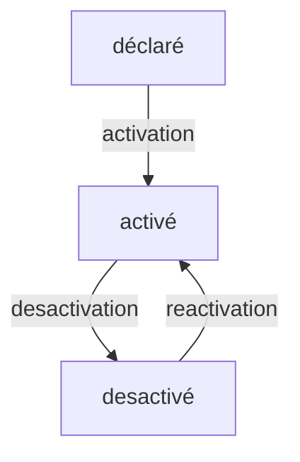
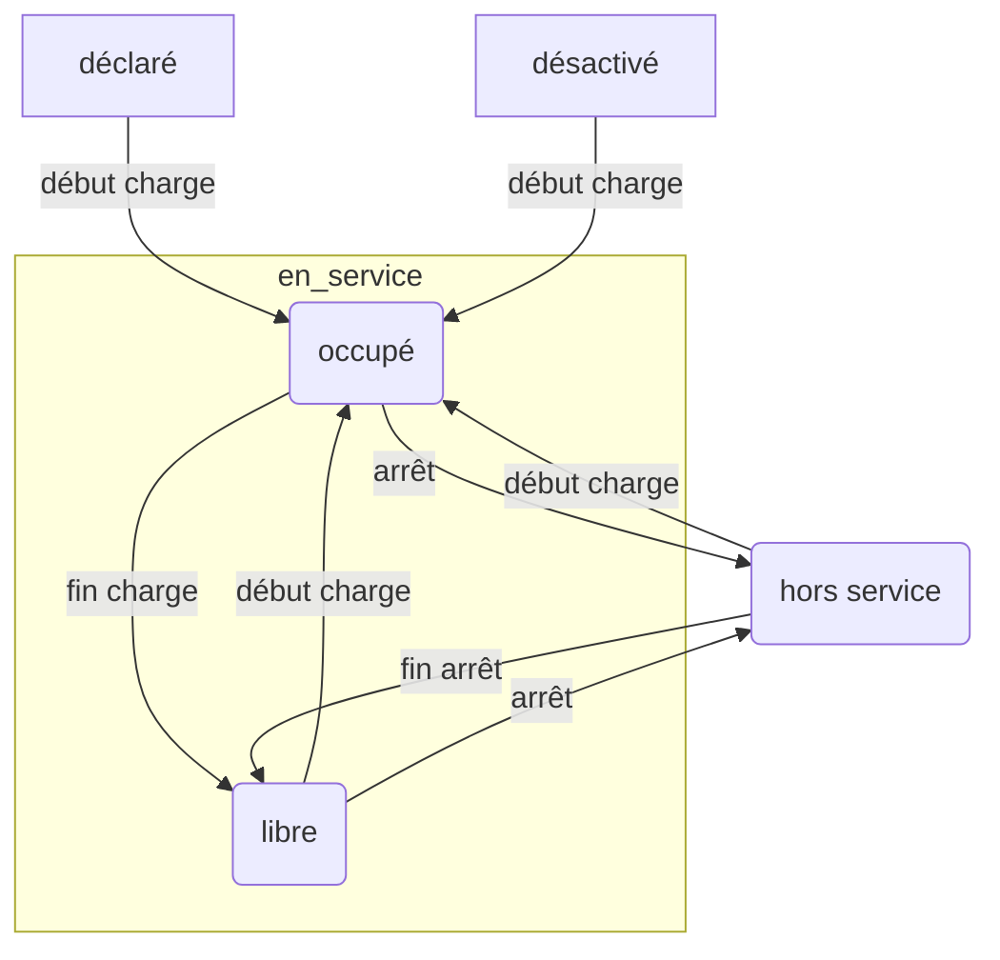

# Indicateurs d'usage - Qualicharge

## Besoin

Les principales attentes concernent :

- la disponibilité : temps pendant lequel une installation est en fonctionnement
- l'utilisation (ou occupation) : temps de recharge effective
- la saturation : temps pendant lequel aucun point de recharge d'un groupe de points de recharge n'est libre
- le facteur de charge : énergie utilisée ramenée à l'énergie utilisable
- les sessions réussies : comparaison entre sessions réussies et non réussies

Les principaux indicateurs sont :

- le taux de disponibilité de la recharge (ratio de la durée en service sur le temps d'ouverture),
- le taux d'utilisation des installations (ratio de la durée de recharge sur la durée en service),
- le taux de saturation (ratio de la durée de saturation sur le temps d'ouverture )
- le facteur de charge (ratio du consommé sur le maximum consommable)
- le taux de sessions réussies (durée et charge supérieures à des seuils)

Les indicateurs associés aux charge partielle/complète ne sont pas abordés.

Pour caractériser ces indicateurs, plusieurs définitions ont été établies notamment par l'AFIREV (voir en Annexe)

*Nota :*

- la notion de groupe fait référence à une station ou à un "parc de recharge (pool)" (regroupement de stations en un même lieu suivant la définition AFIR),
- les indicateurs ci-dessus sont "scalables" (aggrégation possible sur différentes échelles de temps et d'espace),
- les indicateurs sur les stations se déduisent des indicateurs sur les points de recharge par aggrégation également à l'exception de l'indicateur de saturation qui ne peut être calculé que pour un ensemble de points de recharge considéré,
- l'aggrégation nécessite de définir un périmètre cohérent avec le changement d'échelle défini. Par exemple, si le périmètre est l'ensemble des points de recharge déclarés (qui augmente avec le temps si aucune suppression n'est effectuée), les indicateurs calculés ne seront pas comparables. Le périmètre doit donc tenir compte des points de recharge en activité à un instant donné,

## Principes généraux

### Etats globaux des points de recharge

Un point de recharge a trois états successifs :

- "déclaré" : Point de recharge créé mais non encore utilisé
- "en activité" : Point de recharge utilisé
- "desactivé" : Point de charge plus utilisé

Cette distinction permet les calculs de taux d'utilisation et de taux de disponibilité qui ne s'appliquent qu'aux points de recharge "en activité".

Le passage d'un état à un autre s'effectue par une transition.

*Nota :*

- En l'absence de transition explicite d'activation et de réactivation, on considère que l'activation et la réactivation s'effectuent par le démarrage d'une recharge
- En l'absence de transition explicite de désactivation, on considère que la désactivation a lieu après une période longue sans session (ex. 1 mois)
- Les points de recharge pris en compte dans les aggrégations sont ceux qui sont "activé" à un instant donné

### Etats d'utilisation des points de recharge

Le calcul des indicateurs repose sur l'enregistrement du temps passé dans chacun des trois états principaux d'un point de recharge "activé" :

- "libre" : En fonctionnement, non occupé et pendant la période d'ouverture
- "occupe" : En charge
- "hors service" : Mise à l'arrêt (ex. maintenance) ou arrêt intempestif (défaillance : statut erreur ou inconnu).

*NOTA :*

- Chacun des trois états (libre, occupé, hors service) peut être doublé pour tenir compte des périodes d'ouverture du point de recharge.
  - requis: pendant la période d'ouverture,
  - non requis: hors période d'ouverture.
- L'état "hors_service" peut être décomposé en états plus précis en fonction du temps de présence :
  - interruption courte < 2h,
  - interruption longue < 24h,
  - arrêt court < 7j,
  - arrêt long > 7j.

**Dans un premier temps, on se limite au suivi du temps passé dans les trois états principaux "libre", "occupe", "hors_service" et avec un temps d'ouverture de 100 %.**

### Etats d'un groupe de points de recharge

L'état d'un groupe de points de recharge est à considérer pour prendre en compte la notion de saturation.

On peut alors distinguer les états suivants calculés à partir des états des points de recharge associés :

- "désactivé" : tous les pdc sont dans l'état "desactive" ou "declare",
- "hors_service" : aucun pdc n'est dans l'état "libre" ou "occupe" et au moins un pdc est dans l'état "hors_service",
- "saturé" : très peu de pdc (ex. moins de 10 %) est dans l'état "libre" et au moins un pdc est dans l'état "occupe",
- "surchargé" : peu de pdc (ex. moins de 20 %) est dans l'état "libre" et le groupe n'est pas "saturé",
- "actif" : au moins un pdc est dans l'état "occupe" et le groupe n'est pas "surchargé"
- "inactif" : aucun pdc n'est dans l'état "occupe"

L'application de ces règles pour un groupe composé d'un seul point de recharge est la suivante :

- "désactivé" : le pdc est dans l'état "declare" ou "desactive",
- "hors_service" : le pdc est dans l'état "hors_service",
- "saturé" : le pdc est dans l'état "occupe",
- "surchargé" : jamais
- "actif" : jamais
- "inactif" : le pdc est dans l'état "libre"

On a donc une correspondance entre l'état "occupe" du point de recharge et l'état "saturé" de la station ainsi qu'entre l'état "libre" du point de recharge et l'état "inactif" de la station.

Un seuil à 10% pour la saturation se traduit une absence de point de recharge libre pour les stations de moins de 10 pdc.
Un seuil à 20% pour la surcharge se traduit une absence de surcharge pour les stations de moins de 5 pdc.

*NOTA :*

- le temps passé dans chaque état pour un point de charge ne suffit pas à en déduire un niveau de saturation. Par exemple, pour une station composée de deux points de recharge et pour une heure donnée, si chaque point de charge est "libre" une demi-heure et "occupe" une demi-heure, on peut avoir les deux situations suivantes :
  - la station est "saturé" une demi-heure et "inactif" une demi-heure (si les deux pdc sont en charge en même temps),
  - la station est "actif" sur toute la durée (si les deux pdc sont en charge successivement),

## Indicateurs retenus pour Qualicharge

Les propositions ci-dessous s'appuient sur les définitions AFIREV, le retour d'expérience 2023 et la structure Qualicharge.

### Indicateurs de Temps

Le temps passé dans chaque état peut être aggrégé à différents niveaux temporels ou spaciaux.
Il peut être exprimé en valeur cumulée ou bien en pourcentage du temps d'ouverture.

Pour un point de recharge :

- temps de disponibilité (TD) : temps passé dans les états "libre" et "occupe"
- temps d'indisponibilité (TI) : temps passé dans l'état "hors service", "déclaré ou "désactivé"
- temps d'utilisation (TU) : temps passé dans l'état "occupe"

Pour un groupe de points de recharge :

- temps de disponibilité (TD) : temps passé dans les états "saturé", "surchargé", "actif" et "inactif"
- temps d'indisponibilité (TI) : temps passé dans les états "hors service" ou "désactivé"
- temps de saturation (TS) : temps passé dans l'état "saturé"
- temps de surcharge (TP) : temps passé dans l'état "surchargé"

*NOTA :*

- temps d'ouverture (TO) : considéré comme la durée de la période (taux d'ouverture à 100%)
- Le temps de disponibilité peut également être calculé comme la différence du temps d'ouverture et du temps d'indisponibilité.

### Taux de disponibilité d'un point de recharge

Définition pour un point de recharge "en activité" :

- Temps de disponibilité (TD) divisé par le temps d'ouverture (TO) d'un point de recharge sur la période.
  
  L'agrégation de plusieurs disponibilités est le rapport de la somme des TD sur la somme des TO. Ceci permet de traiter l'agrégation sur plusieurs échelles de temps ou sur un périmètre donné (uniquement les points de recharge dans l'état "en activité").

Exemples:

- si un pdc A est disponible à 100 % et un pdc B est disponible à 50 % sur la même période, l'ensemble aura une disponibilité de 75 %
- si un pdc A est disponible à 100 % sur un jour et à 25 % sur quatre jours, il aura une disponibilité de 40 % sur cinq jours.

### Taux d'utilisation d'un point de recharge

Définition pour un point de recharge "activé" :

- Temps d'utilisation (TU) divisé par le temps de disponibilité (TD).
  
  L'agrégation s'effectue également en divisant la somme des numérateurs par la somme des dénominateurs (pour les points de recharge "activé").

### Taux des stations et parcs

Pour les stations et les parcs, on peut calculer de la même manière les taux en fonction du temps passés dans les états définis :

- Taux de saturation : temps de saturation (TS) divisé par le temps de disponibilité (TD)
- Taux de surcharge : temps de surcharge (TP) divisé par le temps de disponibilité (TD)
- Taux de disponibilité : temps de disponibilité (TD) divisé par le temps d'ouverture (TO) 

### Ratio de saturation ou de surcharge horaire

La saturation (ou surcharge) peut faire l'objet d'un indicateur par tranche horaire en considérant un état booléen de saturation (ou surcharge) horaire défini par un temps de saturation (ou surcharge) supérieur à un seuil (ex. 15 mn) par tranche horaire.

### Facteur de charge

Définition pour un point de recharge "activé" :

- Cumul de `energy` divisé par l'énergie maximale (puissance nominale multipliée par le temps d'ouverture) sur la période

L'agrégation s'effectue également en divisant la somme des numérateurs par la somme des dénominateurs (pour les points de recharge "activé").

### Taux de sessions réussies

Une session réussie est une session ayant duré plus de 2 minutes et ayant fourni une énergie supérieure à 0,5 kWh.

Définition pour un point de recharge "activé"  :

- Nombre de `session` réussies divisé par le nombre total de `session` sur la période

L'agrégation s'effectue également en divisant la somme des numérateurs par la somme des dénominateurs (pour les points de recharge "activé").

## Structuration Qualicharge

### Indicateurs globaux

Les indicateurs d'usage historisés sont les suivants (pour une période donnée et sur un périmètre géographique) :

| id        | nom                                                        | Pr  | type  | historisé             |
| --------- | ---------------------------------------------------------- | --- | ----- | --------------------- |
| u1-x-yy-z | Durée d'usage par tranche horaire et par état des pdc      | 2   | usage | oui (national/région) |
| u2-x-yy-z | Durée d'usage par tranche horaire et par état des stations | 2   | usage | oui (national/région) |

Les durées calculées sont les durées quotidiennes. Le total des états est donc de 24 h multiplié par le nombre de points de recharge et par le nombre de jours.

Les valeurs sont stockées dans les champs suivants :

Pour les points de recharge :

- value : durée totale cumulée (24h x nombre de jours)
- category : tranche horaire (ex. 0 pour la tranche de 0h00 à 0h59)
- extras :
  - occupe : durée d'occupation
  - libre : durée dans l'état libre
  - hors-service : durée dans l'état hors-service

Pour les stations ou les pools :

- value : durée totale cumulée (24h x nombre de jours)
- category : tranche horaire
- extras :
  - saturé : durée de saturation
  - surchargé : durée de surcharge
  - actif : durée dans l'état actif
  - inactif : durée dans l'état inactif
  - hors-service : durée dans l'état hors-service

Ces indicateurs (ainsi que l'indicateur d'activité) permettent de calculer les indicateurs non historisés suivants :

| id        | nom                                              | Pr  | type  | historisé |
| --------- | ------------------------------------------------ | --- | ----- | --------- |
| q1-x-yy-z | Taux de disponibilité par catégorie de puissance | 3   | usage | synthèse  |
| q2-x-yy-z | Taux d'utilisation                               | 2   | usage | synthèse  |
| q3-x-yy-z | Taux de saturation des stations                  | 2   | usage | synthèse  |

### Indicateurs unitaires

Les indicateurs sont calculés également avec un découpage par point de recharge et par station.

Les valeurs sont stockées dans les champs suivants :

Pour les points de recharge :

- value : durée totale cumulée (24h x nombre de jours)
- category : id_pdc_itinerance
- extras : cf chapitre précédent

Pour les stations ou les pools :

- value : durée totale cumulée (24h x nombre de jours)
- category : id_station_itinerance (ou id du pool)
- extras : cf chapitre précédent

Chaque champ `extras` contient une liste de 24 valeurs correspondant aux tranches horaires.

## Mise en oeuvre

### Détermination des états des points de recharge

Les sessions (plus fiables) sont utilisées en priorité par rapport aux statuts pour déterminer les états "désactivé" et "occupe".

- "désactivé" : s'il n'y a eu aucune session pendant une période longue (ex. 1 mois)
- sinon "occupé" : si l'état est "occupe" pendant la durée d'une session
- sinon "hors_service" : si l'état est "hors_service" entre un `etat_pdc` "hors_service" et un `etat_pdc` "en service"
- sinon "libre" : complément des autres états

*NOTA :*

- le statut "inconnu" n'est pas pris en compte (on attend un changement d'état explicite),
- en cas de chevauchement entre une période "occupe" et "hors_service", la période "occupe" est prioritaire.

### Détermination des états des stations et pool

L'état des stations est calculé à partir de l'état des points de recharge.

La méthode consiste à échantilloner la succession d'état des points de recharge sur un intervalle puis à aggréger pour chaque pas de temps l'état des points de recharge suivant les règles définies au chapitre précédent :

- "désactivé" : si tous les pdc sont dans l'état "desactive",
- sinon "hors_service" : si aucun pdc n'est dans l'état "libre" ou "occupe" et si au moins un pdc est dans l'état "hors_service",
- sinon "inactif" : si aucun pdc n'est dans l'état "occupe",
- sinon "saturé" : si très peu de pdc (ex. moins de 10 %) est dans l'état "libre",
- sinon "surchargé" : si peu de pdc (ex. moins de 20 %) est dans l'état "libre",
- sinon "actif" : complément des autres états 

La durée d'échantillonage doit être inférieure à la durée de cumul retenue pour les indicateurs (ex. 1 mn ou 5 mn) 

### Calcul des indicateurs historisés

Les indicateurs historisés sont calculés quotidiennement dans une même fonction qui réalise les opérations suivantes :

- extraction des sessions et statuts à traiter pour un périmètre physique (liste de points de recharge) et un périmètre temporel (journée)
- calcul des états des points de recharge
- suppression des états d'une durée inférieure à la durée d'échantillonage
- échantillonnage des états des points de recharge
- calcul des états échantillonés des stations
- calcul des temps cumulés pour chaque état pour les points de recharge et les stations
- génération des indicateurs à partir de ces temps cumulés

Le temps de cumul retenu est d'une heure (découpage d'une journée en 24 tranches horaires).

## Annexe : Définitions

[Disponibilité (NF EN 13306)](http://maint.t.i.b.free.fr/Files/Other/NF%20EN%2013306.pdf)

Aptitude d’un bien à être en état d’accomplir une fonction requise dans des conditions données, à un instant donné ou pendant un intervalle de temps donné, en supposant que la fourniture des moyens extérieurs est assurée.

[Taux de sessions de recharge réussies (définition AFIREV)](https://www.observatoire-recharge-afirev.fr/wp-content/uploads/2023/06/ObsAFIREV2023_AnnexesMethodologiques-1.pdf)

Le taux de sessions de recharge réussies est le rapport entre le nombre des sessions de recharge réussies et le nombre total de sessions de recharge sur la période considérée. Sont considérées comme « réussies », les sessions de recharge respectant un des deux critères suivants :

- Les sessions de recharge ayant duré plus de 2 minutes ET ayant fourni une énergie supérieure à 0,5 kWh.
- Les sessions de recharge ayant été interrompues volontairement par le client.

Seules les sessions de recharge démarrées après authentification puis autorisation du superviseur sont prises en compte dans le calcul (présentant un « start » ou autre statut équivalent permettant d’identifier le lancement de la recharge depuis l’outil de supervision des bornes). Les sessions de recharge sur des prises de type EF sont intégrées au calcul.

[Taux de disponibilité des points de recharge (définition AFIREV)](https://www.observatoire-recharge-afirev.fr/wp-content/uploads/2023/06/ObsAFIREV2023_AnnexesMethodologiques-1.pdf)

Le taux de disponibilité des points de recharge est le rapport entre le temps de disponibilité des points de recharge et le temps total de la période étudiée. Sont considérées comme « indisponible » un point de recharge dont l’état est :

- En statut erreur (« Faulted » ou « OutOfOrder »)
- En statut inconnu, c’est-à-dire en perte de communication (« Unknown ») depuis plus de 24h.
- Dont l’accès est impossible à l’usager peu importe la cause (ex : maintenance)

Seule la disponibilité lors des horaires d’ouverture commerciaux de la station (horaires communiqués à l’usager) est prise en compte. Dans ce cas, au dénominateur de l’indicateur, le temps total de la période étudiée est le temps total d’ouverture de la station sur la période étudiée.  Le calcul du temps de disponibilité d’un point de recharge s’effectue comme une moyenne du temps de disponibilité des connecteurs de ce point de recharge.

[Taux de points de charge disponibles 99% du temps (définition AFIREV)](https://www.observatoire-recharge-afirev.fr/wp-content/uploads/2023/06/ObsAFIREV2023_AnnexesMethodologiques-1.pdf)

Le taux de points de charge disponibles 99% du temps est le nombre de points de charge réputés disponibles plus de 99% du temps par rapport au nombre total de points de charge en interopérabilité dans la plateforme Gireve. La définition d’un point de charge indisponible est celle de la charte qualité de l’AFIREV:

- est considéré indisponible un point de charge en statut Hors Service.

[Taux de points de charge indisponibles depuis plus de 7 jours (définition AFIREV)](https://www.observatoire-recharge-afirev.fr/wp-content/uploads/2023/06/ObsAFIREV2023_AnnexesMethodologiques-1.pdf)

Le taux de points de charge indisponibles depuis plus de 7 jours est le nombre de points de charge indisponibles depuis plus de 7 jours par rapport au nombre total de points de charge en interopérabilité dans la plateforme Gireve. La définition d’un point de charge indisponible est celle de la charte qualité de l’AFIREV:

- est considéré indisponible un point de charge en statut Hors Service.
